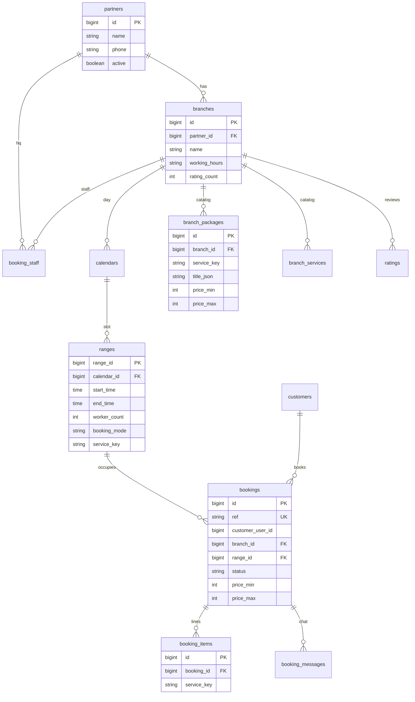

# CRCT-280 — schema outline (after CRCT-289)

Ticket: [CRCT-280](https://nemat-mirzayev.atlassian.net/browse/CRCT-280)  
Depends on: [CRCT-289 ADR](CRCT-289-booking-architecture.md)  
This file is the spike’s migration/ERD deliverable. **No Flyway / entity code until Aziz starts 280.**

Jira: Aziz **Devam Ediyor** after 289 is closed enough. Agent does not transition.

---

## ERD (existing vs new)

Identity tables stay. Catalog + booking rows are new. `appointments` is not on this diagram.

---

## Alter (existing)

### partners

Optional columns if 281 needs them (nullable; no uuid):

- `instagram` varchar
- `description` varchar/text (i18n later if PO insists)

Do not add `id uuid`.

### branches

- Keep `id` bigint, `working_hours` as stored today (string or JSON — do not dual-write).
- `photos` / extra gallery: only if 281 cannot use existing `photo`.
- Rating: keep `ratings` table; `rating_count` remains count until average work is scheduled. Do not add a second review store.

### calendars

Already `branch_id`. Optional: document `service_category` as CSV/`*` for 283 filter. No new calendar table.

### ranges  (this is SLOT)

Add:

| Column | Type | Notes |
|--------|------|--------|
| `booking_mode` | varchar | `instant` \| `approval`, not null, default `instant` |
| `service_key` | varchar null | `*` or one catalog key |
| `booked_count` | int | optional cache; else COUNT bookings |

`worker_count` = capacity. Unique booking occupancy is `(range_id)` with status in (`pending`,`confirmed`).

### device_tokens

No change in 280. 287 may drop unique `user_id` for multi-device.

---

## Create (new)

Names can be adjusted in 280 implementation; meaning is locked.

### Catalog (branch-scoped)

- `branch_packages` — `service_key` `pkg:…`, titles JSON az/en/ru, `price_min`/`price_max` qəpik, duration minutes, `included_service_keys` JSON array, `active`
- `branch_services` — `svc:…`, same money/i18n, `direct_category` for `dir:repair|inspection|trade` if not a separate table
- `branch_service_brands` — which brands a service applies to (`*` = all)

FK: `branch_id` → `branches.id`. Unique `(branch_id, service_key)`.

### Booking

- `bookings`
  - `id` bigint
  - `ref` varchar unique (`CC-` + 6 digits)
  - `customer_user_id` → customers.user_id
  - `branch_id`, `range_id` (slot)
  - `vin` / `car_id` nullable
  - `status`: `pending` \| `confirmed` \| `rejected` \| `cancelled` \| `completed`
  - `price_min`, `price_max`, `currency` default AZN
  - `pending_expires_at` timestamptz **nullable** (no default TTL)
  - `created_at` / `updated_at` timestamptz, store/display Asia/Baku
- `booking_items` — `booking_id`, `service_key`, optional title snapshot, optional line prices
- `booking_messages` — `booking_id`, `from_role` (`customer`\|`branch`), `body`, `created_at`  
  286 can add `read_at` if needed.

Indexes: `(branch_id, status)`, `(range_id)`, `(customer_user_id)`, unique `ref`.

---

## Redis

Owner booking lists/details are **user data**. If 284+ caches them, same PR must `evict*` after commit. Admin HTML stays DB-only. Do not cache-write without writers.

Suggested keys (only if we cache): `booking:list:{userId}:{lang}` — evict on create/cancel/status. Prefer no cache until a GET is hot.

---

## Seed (280 DoD, still not this spike)

Use existing Hyper partner + two branches. Attach packages/services to those `branch_id`s. `Hyper Extra` as a `pkg:` on the same partner if PO still wants it — not a second `partners` row unless product asks.

---

## OpenAPI

Stub: `CRCT-289-booking-openapi-stub.yaml`. Real paths land in 281–287.

---

## Out of 280

Entity/repository Java, Flyway if we add it, owner GET/POST, staff accept/reject, chat, push, Flutter.
