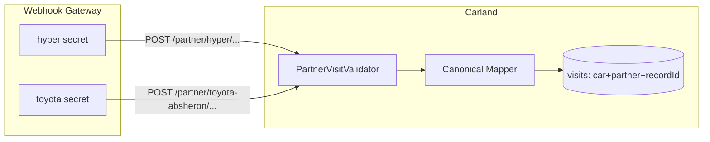

# Multi-Partner Webhook Strategy — Carland Service

**Document type:** Architecture & product advisory  
**Scope:** Partner identification, webhook auth, data model, and rollout plan  
**Status:** Recommendation (no code changes in this document)

---

## Executive summary

The **short answer:** the foundation for multi-partner support **partially exists**, but the **webhook and visit layers are effectively locked to Hyper today**. Adding Toyota Absheron (or similar partners) tomorrow would *work* in a pinch, but **clean and secure separation** requires a few strategic changes.

---

## 1. What is already in place?

| Layer | Status |
|-------|--------|
| `partners` table | **Ready** — `id`, `name`, `source`, `logo`, `dealer` |
| `EnumPartnerId` | **Ready** — `HYPER(1)`, `AVTOVAZ(2)` |
| Partner on visit | **Ready** — `serviceCenterId` + `serviceCenterName` |
| Car profile | **Ready** — `servicedPartnerIds[]` (which partners have serviced the car) |
| Mobile API v2 | **Ready** — each visit returns `partner`, `serviceCenterId` |
| Webhook ingest | **Hyper-specific** — DTOs, mapper, default partner = Hyper |
| Auth | **Single `WEBHOOK_SECRET`** — signature does not identify the partner |
| Visit unique key | **`(car_id, hyper_record_id)`** — no partner scope |

**In short:** the data model’s “partner identity” layer was designed with multi-partner in mind; the **integration layer still behaves like a single partner**.

---

## 2. Critical risk: `recordId` collision

Today the idempotency key is: **`car + recordId`**.

If Toyota sends `recordId=19387` and Hyper also has `recordId=19387` for the **same car**, the second record would either overwrite the first or hit a unique constraint failure.

For multi-partner, this is the **most urgent** issue.

**What it should be:** composite unique key **`(car_id, partner_id, record_id)`**.

The column is named `hyperRecordId` — semantically it should be generalized (e.g. `partnerRecordId` / `externalRecordId`).

---

## 3. How do we separate partners? (Three approaches)

### 3.1 URL path *(recommended — clearest)*

```
POST /webhook/partner/hyper/new-service-visit
POST /webhook/partner/toyota-absheron/new-service-visit
```

- Partner identity comes from the URL; do not rely on the body alone
- Easy per-partner rate limits and IP allowlists in nginx
- Extends the existing `/webhook/partner/...` path pattern

### 3.2 Per-partner secret *(recommended — security)*

```
Hyper  → WEBHOOK_SECRET_HYPER
Toyota → WEBHOOK_SECRET_TOYOTA
```

- Signature provides both **authentication** and **partner identity**
- If one partner’s secret leaks, others are unaffected
- Webhook gateway holds a partner registry: `{ slug, secret, carlandPartnerId }`

### 3.3 `source` / `partnerId` in body *(not sufficient alone)*

- Can be used **together with** auth, but **not trusted by itself**
- Adding `source: "toyota-absheron"` to the Hyper JSON is easy; real identity should come from URL or secret

**Practical combination:** **path slug + per-partner secret + same JSON body format**

---

## 4. JSON format: exact copy vs adapter?

### Scenario A — All partners accept the same spec *(ideal)*

The format you standardized for Hyper becomes the **Carland Partner Webhook Spec**:

```json
{
  "plate": "...",
  "vin": "...",
  "serviceHistory": [{ "recordId": ..., "services": [...] }]
}
```

- Toyota sends the same shape → one mapper, one validator
- Lowest maintenance cost
- Partner onboarding = secret + DB row + path

### Scenario B — Partners send different JSON *(realistic)*

If Toyota uses different field names:

```
Toyota JSON → ToyotaWebhookAdapter → Canonical PartnerVisitPayload → DB
Hyper JSON  → HyperWebhookAdapter   → Canonical PartnerVisitPayload → DB
```

- Internal model is partner-agnostic; adapters sit at the edge
- Hyper adapter effectively exists today; naming should become generic

**Recommendation:** Publish the spec and ask new partners to implement it; add adapters only for partners that cannot comply. Use the Hyper format as the **reference implementation**.

---

## 5. Percentage / `universalServiceId`

`HyperServiceMapping` today maps Hyper’s `universalServiceId` → our `name_en`.

If Toyota uses a different catalog:

- **Partner-scoped mapping table:** `(partner_id, external_service_id) → service_name_en`
- Or migrate all partners to a **shared catalog** (cleanest long term)
- `Percentage.partnerRecordId` exists but **which partner** applied it is not stored — with multiple partners, **`partnerId` should be stored too**

The percentage sync rule (only refresh from the newest visit) should be **partner-aware**: an old Hyper visit must not overwrite percentages updated by a newer Toyota visit. This is partly achievable via `serviceCenterId`, but **service mapping must be partner-scoped**.

---

## 6. Mobile / history API

`GET .../service-history/v2` today:

- If cache exists → reads from DB (all partners’ visits)
- If no cache → **pulls only from Hyper API**

Even if Toyota sends visits via webhook, when a customer adds a car the “live pull” still goes to Hyper. With multiple partners:

- Remove live pull (webhook + cache only), **or**
- Add a **per-partner pull adapter**, **or**
- Treat webhook as primary source; pull only for backfill/onboarding

---

## 7. Recommended roadmap



| Phase | Work | Effort |
|-------|------|--------|
| **1** | `(car_id, partner_id, record_id)` unique constraint + migration | Small, **critical** |
| **2** | Partner slug in path + per-partner webhook secret | Medium |
| **3** | Rename `Hyper*` → `Partner*`; partner from request context (remove hardcoded Hyper) | Medium |
| **4** | Partner-aware percentage / service mapping | Medium |
| **5** | Toyota adapter (if JSON differs) | Per partner |
| **6** | Clarify live history pull strategy | Product decision |

---

## 8. Minimum to add Toyota tomorrow

1. Row in `partners` + `EnumPartnerId.TOYOTA_ABSHERON(3)` (or DB-only id)
2. Separate webhook secret + path slug
3. Fix DB unique constraint (partner-scoped `recordId`)
4. In ingest: replace `DEFAULT_PARTNER = HYPER` with partner id from request context

---

## 9. Conclusion

| Area | Readiness |
|------|-----------|
| Partner table, visit `serviceCenterId`, mobile partner display | **~40% ready** |
| Webhook auth/partner separation, recordId scope, Hyper-centric code, percentage mapping, live fetch strategy | **~60% gap** |

**Infrastructure is partially ready; integration is Hyper-centric today.**

---

## 10. Open product question

Before implementation, clarify:

**Will new partners adopt the same JSON spec as Hyper, or will each send its own format?**

That answer determines whether adapters are required; the rest of the architecture stays the same.

---

*Generated for the Carland Service project — multi-partner webhook advisory.*
